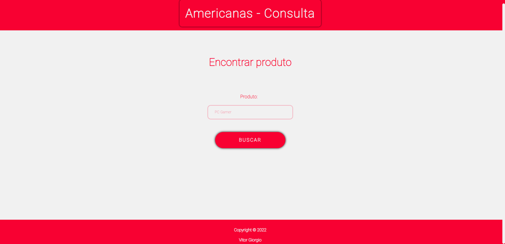
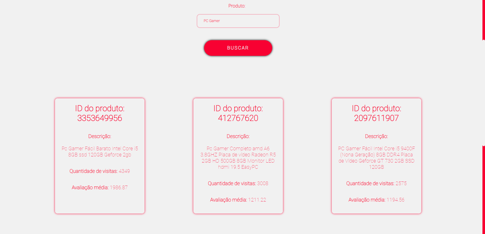
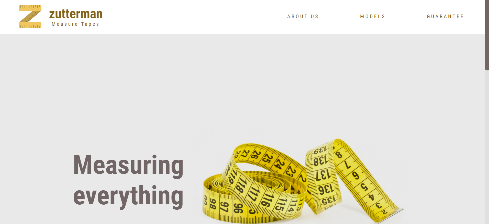

<div align="center">
    <h1>Calindra Code Challenges</h1>
    <p>
    <a href="https://nodejs.org/en/"></a>
    <a href="https://pt-br.reactjs.org/"></a>
    <a href="./LICENSE"></a>
    </p>
</div>

## 📜 Descrição

<p>
    Este repositório contém a resolução de três desafios propostos pela <b>Calindra</b>:
    <ul>
        <li>2 desafios Front-end</li>
        <li>1 desafio Back-end</li>
    </ul>
</p>

# 1️⃣ Projeto Backend

O projeto consiste na construção de uma API REST que consuma a API de Geolocalização do Google e retorne:

- A distância entre dois ou mais endereços utilizando o algoritmo Euclidiano;
- Os endereços mais próximos da localização atual.

## 🛠️ Tecnologias e ferramentas utilizadas

- [Javascript](https://developer.mozilla.org/pt-BR/docs/Web/JavaScript)
- [Node.js](https://nodejs.org/en/)
- [Express](https://expressjs.com/pt-br/)
- [Insomnia](https://insomnia.rest/)
- [Jest](https://jestjs.io/pt-BR/)

## 🌟 Rodando a aplicação

### Requerimentos

- [Git](https://git-scm.com/) instalado
- [Node](https://node.js.org/) instalado
- [Npm](https://www.npmjs.com/) instalado
- [VSCode](https://code.visualstudio.com/) instalado (mas você pode utilizar outra IDE, se preferir)

<br>

### Siga as etapas para a aplicação funcionar corretamente:

<br>

#### 🟢 No terminal bash (Git), clone este repositório

```
git clone https://github.com/v-giorgio/calindra-challenge.git
```

<br>

#### 🟢 Acesse a pasta do projeto pelo terminal

```
cd calindra-challenge
```

<br>

#### 🟢 Abra o projeto no editor de texto (VSCode)

```
code .
```

<br>

#### 🟢 Abra o terminal e acesse a pasta `backend-challenge`

```
cd backend-challenge
```

<br>

#### 🟢 Acesse o arquivo `.env.example` e copie o seu conteúdo. Crie um novo arquivo chamado `.env` e cole o conteúdo nele.

```
# PORT
PORT=3000

# APIs
GEOLOCATION_API_KEY=
```

#### <b>Atenção</b>:

- O campo `PORT` altera a porta utilizada para rodar a API. Se não for definida, a API rodará normalmente na porta 3000.
- O campo `GEOLOCATION_API_KEY` <b>precisa</b> ser preenchido com uma chave API utilizada nos serviços do Google. Para adquirir uma, vá neste [link](https://developers.google.com/maps/documentation/javascript/get-api-key) e siga corretamente as instruções. Com a `API KEY` em mãos, basta colocá-la no campo `GEOLOCATION_API_KEY`.

<br>

#### 🟢 Execute o comando para instalar as dependências do projeto no backend

```
npm install
```

<br>

#### 🟢 Rode a API

```
npm start
```

#### Você verá essa mensagem: `Api running on 3000`.

<br>

## 🔃 Rotas da API

### 🪧 `/location`

Rota para <b>encontrar</b> todas as distâncias de acordo com as localizações informadas.<br>
Método: `POST`<br>

Template para enviar os dados:

```
{
	"addresses": [
		{
			"street": "Av. Rio Branco",
			"number": "1",
			"neighborhood": "Centro",
			"city": "Rio de Janeiro",
			"state": "RJ",
			"zipcode": "20090003"
		},
		{
			"street": "Praça Mal. Âncora",
			"number": "122",
			"neighborhood": "Centro",
			"city": "Rio de Janeiro",
			"state": "RJ",
			"zipcode": "20021200"
		},
		{
			"street": "Rua 19 de Fevereiro",
			"number": "34",
			"neighborhood": "Botafogo",
			"city": "Rio de Janeiro",
			"state": "RJ",
			"zipcode": "22280030"
		}
	]
}
```

<br>
Resposta:

```
{
	"distance_0_and_1": {
		"address_1": "Av. Rio Branco, 1 - Centro, Rio de Janeiro - RJ, 20090-003, Brazil",
		"address_2": "Praça Mal. Âncora, 122 - Centro, Rio de Janeiro - RJ, 20021-200, Brazil",
		"distance": 0.011921952761606592
	},
	"distance_0_and_2": {
		"address_1": "Av. Rio Branco, 1 - Centro, Rio de Janeiro - RJ, 20090-003, Brazil",
		"address_2": "R. Dezenove de Fevereiro, 34 - Botafogo, Rio de Janeiro - RJ, 22280-030, Brazil",
		"distance": 0.05389910936592824
	},
	"distance_1_and_2": {
		"address_1": "Praça Mal. Âncora, 122 - Centro, Rio de Janeiro - RJ, 20021-200, Brazil",
		"address_2": "R. Dezenove de Fevereiro, 34 - Botafogo, Rio de Janeiro - RJ, 22280-030, Brazil",
		"distance": 0.04988261769725114
	}
}
```

<br>

### 🪧 `/location_nearby`

Rota para <b>encontrar</b> a distância entre todas as localizações informadas e a distância atual, também informada. Também irá retornar a localização mais próxima e a mais distante<br>
Método: `POST`<br>

Template para enviar os dados:

```
{
	"addresses": [
		{
			"street": "Av. Rio Branco",
			"number": "1",
			"neighborhood": "Centro",
			"city": "Rio de Janeiro",
			"state": "RJ",
			"zipcode": "20090003"
		},
		{
			"street": "Praça Mal. Âncora",
			"number": "122",
			"neighborhood": "Centro",
			"city": "Rio de Janeiro",
			"state": "RJ",
			"zipcode": "20021200"
		},
		{
			"street": "Rua 19 de Fevereiro",
			"number": "34",
			"neighborhood": "Botafogo",
			"city": "Rio de Janeiro",
			"state": "RJ",
			"zipcode": "22280030"
		}
	],
	"current_location": {
		"street": "Rua 19 de Fevereiro",
		"number": "34",
		"neighborhood": "Botafogo",
		"city": "Rio de Janeiro",
		"state": "RJ",
		"zipcode": "22280030"
	}
}
```

<br>
Resposta:

```
{
	"distances_to_current": [
		{
			"address": "Av. Rio Branco, 1 - Centro, Rio de Janeiro - RJ, 20090-003, Brazil",
			"distance_to_current": 0.05389910936592824
		},
		{
			"address": "Praça Mal. Âncora, 122 - Centro, Rio de Janeiro - RJ, 20021-200, Brazil",
			"distance_to_current": 0.04988261769725114
		},
		{
			"address": "R. Dezenove de Fevereiro, 34 - Botafogo, Rio de Janeiro - RJ, 22280-030, Brazil",
			"distance_to_current": 0
		}
	],
	"closest_location": {
		"address": "R. Dezenove de Fevereiro, 34 - Botafogo, Rio de Janeiro - RJ, 22280-030, Brazil",
		"distance": 0
	},
	"furthest_location": {
		"address": "Av. Rio Branco, 1 - Centro, Rio de Janeiro - RJ, 20090-003, Brazil",
		"distance": 0.05389910936592824
	}
}
```

<br>

---

<br>

# 2️⃣ Projeto Frontend (1)

O projeto consiste na criação de uma aplicação web que contenha um formulário que será preenchido com o nome de um produto. Em seguida, a aplicação fará uma requisição à uma API e retornar os produtos encontrados em cards.

## 🛠️ Tecnologias e ferramentas utilizadas

- [Typescript](https://www.typescriptlang.org/)
- [React](https://pt-br.reactjs.org/)
- [Styled-components](https://styled-components.com/)
- [Material UI](https://mui.com/pt/)

## 🔍 Visualização

<div align="center">



<br>



<br>

</div>

---

## 🌟 Rodando a aplicação

### Requerimentos

- [Git](https://git-scm.com/) instalado
- [Node](https://node.js.org/) instalado
- [Npm](https://www.npmjs.com/) instalado
- [VSCode](https://code.visualstudio.com/) instalado (mas você pode utilizar outra IDE, se preferir)

<br>

### Siga as etapas para a aplicação funcionar corretamente:

#### 🟠 Na mesma pasta que foi clonada anteriormente, acesse agora a pasta `frontend-challenge-one`

```
cd frontend-challenge-one
```

<br>

#### 🟠 Execute o comando para instalar as dependências do projeto no frontend

```
npm install
```

<br>

#### 🟠 Rode a aplicação

```
npm start
```

#### A aplicação irá rodar em `localhost:3000`

<br>

---

# 2️⃣ Projeto Frontend (2)

O projeto consiste na criação de uma aplicação web totalmente responsiva que siga corretamente a prototipagem fornecida no [Figma](https://www.figma.com/file/GTEyrXtVtgSDeiocLk7KzCFf/layouttesteavaliacao).

## 🛠️ Tecnologias e ferramentas utilizadas

- [Typescript](https://www.typescriptlang.org/)
- [React](https://pt-br.reactjs.org/)
- [Styled-components](https://styled-components.com/)

## 🔍 Visualização

<div align="center">



<br>

</div>

---

## 🌟 Rodando a aplicação

### Requerimentos

- [Git](https://git-scm.com/) instalado
- [Node](https://node.js.org/) instalado
- [Npm](https://www.npmjs.com/) instalado
- [VSCode](https://code.visualstudio.com/) instalado (mas você pode utilizar outra IDE, se preferir)

<br>

### Siga as etapas para a aplicação funcionar corretamente:

#### 🟠 Na mesma pasta que foi clonada anteriormente, acesse agora a pasta `frontend-challenge-two`

```
cd frontend-challenge-two
```

<br>

#### 🟠 Execute o comando para instalar as dependências do projeto no frontend

```
npm install
```

<br>

#### 🟠 Rode a aplicação

```
npm start
```

#### A aplicação irá rodar em `localhost:3000`

<br>

---

<br>

<div align="center">
    <sub>Copyright © 2022</sub>
    <p>MIT licensed</p>
    <h3>✨ Desenvolvido por Vitor Giorgio ✨</h3>
</div>
